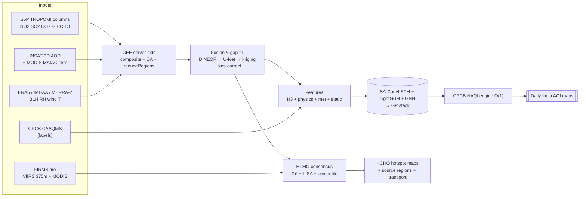

# aqi_india — Surface AQI & HCHO Hotspots over India from Satellite Data

**Bharatiya Antariksh Hackathon 2026 (ISRO) — Problem Statement 3**

Daily **surface air-quality maps** over India derived from satellite columns +
INSAT-3D AOD + reanalysis meteorology and validated against CPCB ground stations,
plus **high-resolution HCHO hotspot maps** during biomass-burning seasons with
source-region identification and fire-HCHO transport attribution — all in one
cloud-native, config-driven, reproducible Python monorepo.


---

## The problem

Most of the global population lives **more than 100 km from an air-quality
monitor** and has no local air-quality information. India's ~500 CPCB stations are
sparse and weighted to cities, so a daily, gap-free, *spatial* picture of pollution
must be **derived from satellites**. Separately, **formaldehyde (HCHO)** is a key
marker of volatile-organic-compound emissions; agricultural-residue burning and
forest fires release large VOC pulses that drive HCHO and downwind ozone
chemistry, concentrated over the Indo-Gangetic Plain and forest belts.

PS3 asks for two things:

- **Objective-1 — Surface AQI.** Predict ground-level multi-pollutant
  concentrations (PM2.5, PM10, NO2, SO2, CO, O3) from columnar satellite data +
  meteorology using CNN / LSTM / CNN-LSTM models, validate against CPCB on
  **RMSE / R / MAE**, and render spatial **AQI maps** over India.
- **Objective-2 — HCHO hotspots.** Map HCHO during biomass-burning seasons,
  identify **source regions** (IGP, forest-fire zones), analyse **fire–HCHO
  correlation**, and assess **transport** with wind/reanalysis data.

---

## What this delivers

**Objective-1**
- Daily 1km **surface-AQI maps** over India with the responsible pollutant and a
  per-pixel uncertainty layer.
- A deterministic, vectorized **CPCB NAQI engine** (8 pollutants, O(1) sub-index →
  max-of-sub-index, CO in mg/m³, O3/CO max(8h,1h), ≥3-pollutant + PM validity).
- A physics-guided **SA-ConvLSTM + LightGBM + GNN → GP-stack** model targeting the
  SOTA India daily R² ≈ 0.86, scored with a leakage-free **CV ladder** (leave-
  station-out + spatiotemporal-blocked) and a locked CPCB hold-out.

**Objective-2**
- High-resolution **HCHO hotspot maps** via a ≥2-of-3 consensus (Getis-Ord Gi* +
  LISA + percentile) on MAD-standardized anomalies.
- **Emerging Hot Spot Analysis** (Gi* + Mann-Kendall + Sen slope) separating
  persistent-industrial from episodic biomass-burning hotspots.
- **Fire–HCHO correlation** (lagged cross-correlation + Granger + dHCHO/FRP) and a
  convergent **transport attribution** (HYSPLIT + trajCluster + CWT/PSCF +
  FLEXPART×FINN).

---

## Quickstart

The offline demo runs on a **light dependency set** (no GEE/credentials, no torch)
and generates the India AQI map + HCHO hotspot map end-to-end on synthetic data.

```bash
git clone <repo-url> bah2026-ps3
cd bah2026-ps3

python3.11 -m venv .venv && source .venv/bin/activate
pip install -e .

aqi demo run        # synthesize → fuse → features → model → NAQI maps → hotspots
```

This writes `data/processed/{grid.nc,stations.parquet,fires.parquet,aqi_grid.nc,
hotspots.geoparquet}` and the flagship figures to **`reports/figures/`** (the
India surface-AQI map and the HCHO hotspot map with fire overlay).

```bash
aqi --help          # ingest / fuse / features / train / maps / hotspots / transport / validate / serve / demo
aqi info            # version + environment summary
```

Real-data paths add optional extras (`pip install -e ".[deep,gee,serve,geo,transport]"`)
and credentials — see [`docs/runbook.md`](docs/runbook.md).

---

## Architecture at a glance

`aqi_india` is a **seven-layer fusion stack** — each layer fills or verifies the
one below — fronted by Google Earth Engine for planetary server-side compute and
backed by an H3 + COG + Zarr + DuckDB O(1)/O(log n) data platform.



The seven layers: **L0** gap-free prior (CAMS/MERRA-2) · **L1** multi-satellite
harmonization · **L2** per-species gap-fill · **L3** bias-correction to CPCB ·
**L4** surface model · **L5** ground anchoring & uncertainty · **L6** downscaling &
serving. Full detail — including both PS flow diagrams, the data-fusion matrix, the
30+ methods, the O(1) platform, and the risk register — is in
**[`docs/ARCHITECTURE.md`](docs/ARCHITECTURE.md)**.

---

## Features & highlights

- **Physics-guided deep learning** — AOD/BLH PBL normalization, AOD·f(RH)⁻¹
  hygroscopic growth, AER_AI aerosol-type, and the FNR = HCHO/NO2 regime as
  explicit ML channels (the single biggest pre-ML accuracy lift).
- **Leakage-free validation** — the CV ladder (random → temporal → spatial-block →
  spatiotemporal-blocked) plus a locked stratified CPCB hold-out; random CV is
  shown only to quantify the gap.
- **O(1) fusion platform** — Uber H3 res-7 integer cells as the universal join key;
  COG range reads, GeoParquet predicate pushdown, Zarr lazy chunks, DuckDB
  spatial+h3 SQL.
- **Deterministic CPCB NAQI engine** — single fused breakpoint table, vectorized
  `searchsorted` sub-index, unit-correct (CO mg/m³), unit-tested golden vectors.
- **Robust hotspot detection** — MAD-standardized anomalies → FDR-controlled
  Getis-Ord Gi* + LISA + percentile **≥2-of-3 consensus** → EHSA trend labels.
- **Convergent transport attribution** — statistical + Lagrangian + emission-
  inventory lines must agree, not any single method.
- **Two-track delivery** — a static MapLibre + PMTiles + deck.gl site (no server)
  and an interactive Streamlit + TiTiler app, plus a folium single-HTML fallback.
- **Importable on the light set** — heavy/credentialed deps are lazy-imported; the
  whole demo runs without torch or GEE.

---

## Repository structure

```
aqi_india/
├─ conf/                 # Hydra config tree (aoi, dates, grid, datasets, model, aqi, hotspot)
├─ src/aqi_india/
│  ├─ aqi/               # CPCB NAQI breakpoints + pure vectorized engine
│  ├─ ingest/            # S5P, INSAT AOD, MAIAC, FIRMS, ERA5/CDS, IMDAA, MERRA-2, CAMS, CPCB
│  ├─ fusion/            # DINEOF → U-Net inpaint → kriging + bias-correct
│  ├─ features/          # H3 index, physics, met, static covariates, temporal, feature matrix
│  ├─ models/            # SA-ConvLSTM, CNN-LSTM, LightGBM, GNN, stack, train/predict/UQ
│  ├─ hotspot/           # climatology, Gi*, LISA, EHSA, clustering, consensus
│  ├─ transport/         # fire periods, fire-HCHO corr, HYSPLIT, trajCluster, CWT/PSCF
│  ├─ validation/        # metrics, CV ladder, confusion, plots
│  ├─ viz/               # COG/PMTiles export, TiTiler app, Streamlit, cartopy figures
│  ├─ sim/               # offline synthetic data generators (the demo)
│  └─ utils/             # IO, geo bboxes/CRS, logging
├─ docs/                 # ARCHITECTURE, DATA_SOURCES, METHODS, DEV_CONTRACT, runbook, flow_obj1/2
├─ notebooks/            # 00 GEE smoke test … 06 validation report
├─ tests/                # NAQI golden vectors, H3 roundtrip, metrics
└─ reports/figures/      # generated flagship figures (after `aqi demo run`)
```

---

## Documentation

| Doc | What |
| --- | --- |
| [`docs/ARCHITECTURE.md`](docs/ARCHITECTURE.md) | The deep architecture: 7-layer fusion, both pipelines, fusion matrix, methods, O(1) platform, risks, roadmap |
| [`docs/flow_obj1.md`](docs/flow_obj1.md) | Objective-1 PS flow diagram + walkthrough |
| [`docs/flow_obj2.md`](docs/flow_obj2.md) | Objective-2 PS flow diagram + walkthrough |
| [`docs/DATA_SOURCES.md`](docs/DATA_SOURCES.md) | Catalog of **85 datasets** (satellite, reanalysis, ground) |
| [`docs/METHODS.md`](docs/METHODS.md) | Catalog of **118 methods/models** across 9 pipeline stages |
| [`docs/DEV_CONTRACT.md`](docs/DEV_CONTRACT.md) | Frozen public API + synthetic-data schema (binding) |
| [`docs/runbook.md`](docs/runbook.md) | Setup, credentials, Hydra config, CLI, tests, DVC reproduction |

---

## Roadmap

| Phase | Focus |
| --- | --- |
| **0** | Skeleton & GEE proof-of-life (auth, one S5P + one MAIAC tile, CI) |
| **1** | CPCB NAQI engine (golden-vector tests) + ingest backbone |
| **2** | Fusion gap-fill cascade + H3-keyed feature matrix |
| **3** | Obj-1 SA-ConvLSTM + LightGBM + the CV-ladder validation |
| **4** | Obj-2 hotspots (Gi*/LISA/EHSA) + fire-HCHO transport |
| **5** | Two-track viz/serving, packaging, the two PS flow diagrams |

See [`docs/ARCHITECTURE.md` §16](docs/ARCHITECTURE.md#16-phased-build-roadmap) for
the full phased plan with gates.

---

## License

MIT. Built for BAH 2026 (ISRO) Problem Statement 3. India boundaries: GADM v4.1 for
development, Survey of India / Bhuvan for the final submission.
