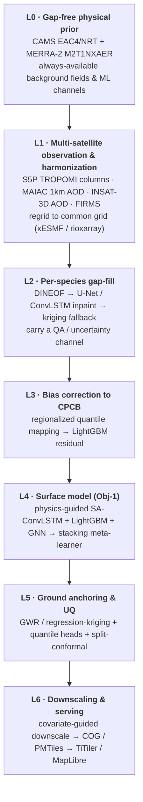
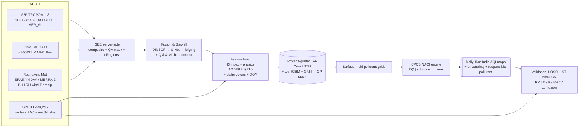
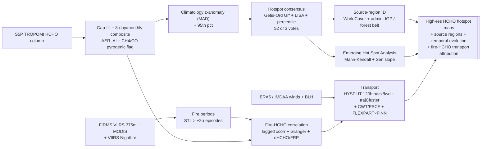

# Architecture — `aqi_india`

**BAH 2026 (ISRO) Problem Statement 3 — Surface AQI Mapping & HCHO Hotspot
Detection over India from Satellite Data**

This is the deep architecture document for the project. It explains the mission
decomposition, the seven-layer fusion architecture, the design principles, the
full repository layout, the two objective pipelines stage-by-stage, the
per-pollutant data-fusion matrix, the consolidated methods across nine stages,
the verification & gap-fill strategy, the fast-platform / O(1) design, the tech
stack, data flow & orchestration, deployment & reproducibility, how the design
maps to each judging criterion, the ranked risk register, and the phased
roadmap. The two PS-required flow diagrams are embedded in
[§7](#7-objective-1-pipeline-surface-aqi) and
[§8](#8-objective-2-pipeline-hcho-hotspots--transport) (and on their own focused
pages, [`flow_obj1.md`](flow_obj1.md) and [`flow_obj2.md`](flow_obj2.md)).

Companion references: [`DATA_SOURCES.md`](DATA_SOURCES.md) (85 datasets),
[`METHODS.md`](METHODS.md) (118 methods), [`DEV_CONTRACT.md`](DEV_CONTRACT.md)
(frozen API + synthetic-data schema), and [`runbook.md`](runbook.md) (setup &
reproduction).

---

## Table of contents

1. [Mission decomposition](#1-mission-decomposition)
2. [The seven-layer fusion architecture](#2-the-seven-layer-fusion-architecture)
3. [Design principles](#3-design-principles)
4. [Repository & module layout](#4-repository--module-layout)
5. [Per-pollutant data-fusion matrix](#5-per-pollutant-data-fusion-matrix)
6. [Verification & gap-fill strategy (failure modes A–E)](#6-verification--gap-fill-strategy-failure-modes-ae)
7. [Objective-1 pipeline (Surface AQI)](#7-objective-1-pipeline-surface-aqi)
8. [Objective-2 pipeline (HCHO hotspots & transport)](#8-objective-2-pipeline-hcho-hotspots--transport)
9. [Consolidated methods across the nine stages](#9-consolidated-methods-across-the-nine-stages)
10. [Fast-platform / O(1) design](#10-fast-platform--o1-design)
11. [Tech stack](#11-tech-stack)
12. [Data flow & orchestration (DVC / Hydra / MLflow)](#12-data-flow--orchestration-dvc--hydra--mlflow)
13. [Deployment & reproducibility](#13-deployment--reproducibility)
14. [Mapping the design to judging criteria](#14-mapping-the-design-to-judging-criteria)
15. [Risk register (ranked)](#15-risk-register-ranked)
16. [Phased build roadmap](#16-phased-build-roadmap)

---

## 1. Mission decomposition

PS3 mandates **two deliverables on one platform**:

- **Objective-1 — Surface AQI.** Produce *daily surface AQI maps over India* from
  satellite columns (Sentinel-5P TROPOMI NO2/SO2/CO/O3/HCHO), INSAT-3D AOD, and
  reanalysis meteorology, by training CNN / LSTM / CNN-LSTM models to predict
  **surface pollutant concentrations** that are validated against CPCB ground
  stations and scored on **RMSE / R / MAE**. AQI is then a deterministic O(1)
  CPCB-NAQI lookup on top of the predicted concentrations.
- **Objective-2 — HCHO hotspots.** Produce *high-resolution HCHO hotspot maps*
  during biomass-burning seasons, identify the major **source regions**
  (Indo-Gangetic Plain, forest-fire zones), correlate **fire activity with HCHO**,
  and analyse **transport** with wind/reanalysis data.

The central design decomposition is therefore:

| Axis | Objective-1 | Objective-2 |
| --- | --- | --- |
| **Target** | CPCB NAQI from surface PM2.5/PM10/NO2/SO2/CO/O3 | TROPOMI HCHO column hotspots |
| **Learning** | supervised (CPCB labels) regression of column→surface | unsupervised statistics + causality + transport |
| **Scoring** | RMSE / R / MAE vs CPCB | hotspot accuracy/clarity, integration, interpretation, viz, innovation |
| **Headline output** | daily 1km India AQI map | confirmed hotspot polygons + EHSA trend + fire-transport attribution |

We build **one Python monorepo**, `aqi_india` (src/ layout, Python 3.11), that is
**cloud-native** (Google Earth Engine does the planetary heavy lifting
server-side; nothing is bulk-downloaded), **modular** (each pipeline stage is an
importable subpackage with a Typer CLI entrypoint), **config-driven** (Hydra/YAML
— no hard-coded paths, AOIs, dates, or hyperparameters), **reproducible** (pinned
deps, DVC-tracked artifacts, fixed seeds, Docker), and **validation-first** (the
CV ladder and a locked CPCB hold-out are wired in before any model is trusted).

The product surface is **two-track**: a polished static MapLibre + PMTiles +
deck.gl site (no server) for the public/judge demo, plus an interactive Streamlit
+ TiTiler app for live palette / date-slider / per-pixel AQI query. Both consume
the **same** Cloud-Optimized GeoTIFF (COG) + GeoParquet artifacts the pipelines
emit.

> **Importable on the light set.** Per [`DEV_CONTRACT.md`](DEV_CONTRACT.md), the
> package imports with only the light dependency set (numpy, pandas, scipy,
> scikit-learn, lightgbm, h3, matplotlib, geopandas, shapely, esda, libpysal,
> pymannkendall, statsmodels, folium, xarray, netCDF4, typer, hydra). Heavy or
> credentialed dependencies (torch, earthengine-api, cdsapi, pykrige, xesmf,
> hdbscan) are lazy-imported *inside* functions. The offline `aqi demo run`
> exercises the full chain on synthetic data with no credentials.

---

## 2. The seven-layer fusion architecture

The system is a **layered** stack: each layer fills or verifies the layer below
it. This is the architectural bet that turns 85 heterogeneous datasets into one
coherent, gap-free, ground-anchored product.



- **L0 — Gap-free physical prior.** CAMS EAC4/NRT (NO2/SO2/CO/O3/HCHO/AOD) plus
  MERRA-2 M2T1NXAER provide always-available background fields and ML feature
  channels. We **never reimplement 4D-Var** — we download it as a prior. This is
  the field that is defined everywhere even when every satellite is clouded out.
- **L1 — Multi-satellite observation & harmonization.** Sentinel-5P TROPOMI L3
  columns (`COPERNICUS/S5P/OFFL/L3_{NO2,SO2,CO,O3,HCHO,AER_AI,AER_LH,CLOUD}`),
  MODIS MAIAC AOD (`MODIS/061/MCD19A2_GRANULES`, band `Optical_Depth_055`) as the
  1km AOD backbone, INSAT-3D AOD (MOSDAC/VEDAS, geostationary, fills polar revisit
  gaps), and FIRMS fire. All regridded to a common grid.
- **L2 — Per-species gap-fill.** A DINEOF first pass (label-free, gives
  uncertainty) → U-Net / ConvLSTM partial-convolution inpainting for nonlinear
  cloud/orbit refinement → spatiotemporal kriging fallback. A QA/uncertainty
  channel is carried forward.
- **L3 — Bias correction to CPCB.** Regionalized quantile mapping fixes the whole
  distribution and extremes (critical for AQI category thresholds), then a
  LightGBM residual correction captures state-dependent nonlinear bias on
  BLH/RH/land-use covariates.
- **L4 — Surface model (Obj-1).** Physics-guided **SA-ConvLSTM** (primary,
  satisfies the PS CNN/LSTM wording) + LightGBM/XGBoost tabular baseline + a GNN
  station model, blended by a stacking meta-learner.
- **L5 — Ground anchoring & UQ.** GWR / regression-kriging enforce CPCB agreement;
  quantile heads + split-conformal give per-pixel intervals and an applicability
  (abstention) map.
- **L6 — Downscaling & serving.** Covariate-guided statistical downscaling to 1km;
  export COG / PMTiles; serve via TiTiler / MapLibre.

---

## 3. Design principles

1. **Cloud-native, server-side-first.** GEE does global compute; only compact
   artifacts (COG / GeoParquet / Zarr) leave the cloud. The single biggest speed
   lever in the project.
2. **O(1) / O(log n) access everywhere.** H3 res-7 integer keys turn every
   station↔grid↔fire join into a hash group-by; COG HTTP range reads, GeoParquet
   predicate pushdown, Zarr lazy chunks, and STAC search keep data access cheap.
3. **Modular, single-responsibility.** Every stage is `aqi_india.<stage>` with a
   Typer CLI command and a pure-function core. Each `ingest/*` adapter owns one
   provider's auth + pull + QA.
4. **Config-driven.** Hydra composes dataset / model / AOI / date configs; there
   are zero magic constants in code. Swap `+dates=burn_oct_nov` or
   `+model=cnn_lstm` without editing source.
5. **Reproducible.** Pinned `pyproject.toml`, a DVC `dvc.yaml` DAG, fixed seeds
   (`cfg.project.seed`), Docker, and MLflow run tracking.
6. **Validation-first.** Leave-station-out + spatiotemporal-blocked CV and a
   locked stratified hold-out are wired **before** modeling; random CV is shown
   only to quantify the leakage gap.
7. **Physics-guided ML.** Engineered features (AOD/BLH, AOD·f(RH)⁻¹, AER_AI
   aerosol-type, FNR = HCHO/NO2) and an optional advection-diffusion residual loss
   bake first principles into the learner — the single largest pre-ML accuracy
   lift (raw AOD–PM2.5 R² ≈ 0.4 → ≈ 0.65 with physics channels).

---

## 4. Repository & module layout

```
aqi_india/                          # src/ layout, Python 3.11, hatchling build
├─ pyproject.toml  README.md  Makefile  conf/  docs/  notebooks/  tests/
├─ conf/                            # HYDRA config tree (no constants in code)
│  ├─ config.yaml                   # defaults: aoi=india dates=train grid=latlon_0p05 …
│  ├─ aoi/{india,igp,punjab_haryana,forest_belt}.yaml
│  ├─ dates/{train,burn_oct_nov,burn_apr_may}.yaml
│  ├─ datasets/{s5p,insat_aod,maiac,firms,era5,imdaa,merra2,cams,cpcb}.yaml
│  ├─ grid/{h3_res7,latlon_0p05,latlon_1km}.yaml
│  ├─ model/{saconvlstm,cnn_lstm,lightgbm,gnn,stack}.yaml
│  ├─ aqi/cpcb_naqi.yaml            # breakpoint constants (mirror of breakpoints.py)
│  └─ hotspot/{getis_ord,lisa,stdbscan,hysplit}.yaml
└─ src/aqi_india/
   ├─ __init__.py  cli.py           # Typer root app + sub-Typers
   ├─ data/                         # bundled static assets (offline India boundary, LUTs)
   ├─ utils/      io.py geo.py logging.py          # IO, INDIA/IGP bboxes, CRS, logger
   ├─ aqi/        breakpoints.py naqi.py           # CPCB NAQI constants + pure engine
   ├─ ingest/     gee_auth.py s5p.py insat_aod.py maiac.py firms.py
   │              era5_cds.py imdaa.py merra2.py cams.py cpcb.py aeronet.py
   │              exporters.py                      # GEE → COG/GeoParquet/Zarr bridge
   ├─ fusion/     regrid.py dineof.py inpaint_unet.py kriging.py
   │              biascorrect_qm.py biascorrect_ml.py harmonize.py
   ├─ features/   h3_index.py physics.py met.py static_covars.py
   │              temporal.py feature_matrix.py
   ├─ models/     datasets.py saconvlstm.py convlstm.py cnn_lstm.py
   │              lightgbm_model.py gnn.py stack.py losses.py
   │              train.py predict.py uq.py
   ├─ hotspot/    climatology.py getis_ord.py lisa.py ehsa.py
   │              cluster.py consensus.py
   ├─ transport/  fire_periods.py fire_hcho_corr.py hysplit.py
   │              traj_cluster.py cwt_pscf.py polar.py inventory.py
   ├─ validation/ metrics.py cv.py confusion.py plots.py
   ├─ viz/        cog_export.py pmtiles.py titiler_app.py
   │              dashboard_streamlit.py figures.py static_maplibre/
   └─ sim/        synthetic.py                      # offline synthetic data generators
```

**Module responsibilities**

| Module | Layer | Responsibility |
| --- | --- | --- |
| `utils/` | — | IO helpers, India/IGP/Punjab-Haryana/forest bboxes, CRS constants, logging |
| `aqi/breakpoints.py` | L4/serve | Frozen CPCB NAQI constant tables (8 pollutants, category edges/colors) |
| `aqi/naqi.py` | L4/serve | Pure vectorized NAQI engine: sub-index → max-of-sub-index, validity mask |
| `ingest/*` | L0+L1 | One provider per adapter: GEE auth, S5P, INSAT AOD, MAIAC, FIRMS, ERA5/CDS, IMDAA, MERRA-2, CAMS, CPCB, AERONET; `exporters.py` = GEE→local bridge |
| `fusion/*` | L2+L3 | DINEOF → U-Net inpaint → kriging gap-fill cascade; quantile-map + ML bias-correct; `regrid.py`, `harmonize.py` |
| `features/h3_index.py` | platform | The O(1) H3 res-7 join key (frozen API) |
| `features/physics.py` | L4 | AOD/BLH, f(RH), AOD·MEE, AER_AI aerosol-type, FNR channels |
| `features/{met,static_covars,temporal,feature_matrix}.py` | L4 | met channels, DEM/landcover/nightlights/population, DOY encodings, `[B,T,C,H,W]` assembly |
| `models/*` | L4+L5 | `[B,T,C,H,W]` loaders + SA-ConvLSTM/CNN-LSTM/LightGBM/GNN/stack + conformal UQ + train/predict |
| `hotspot/*` | Obj-2 | climatology z-anomaly, Gi*, LISA, EHSA, HDBSCAN/ST-DBSCAN clustering, ≥2-of-3 consensus |
| `transport/*` | Obj-2 | fire-period extraction, fire-HCHO correlation, HYSPLIT, trajCluster, CWT/PSCF, polar plots, emission inventory |
| `validation/*` | L5 | metrics, CV ladder, AQI confusion matrix, Taylor/residual plots |
| `viz/*` | L6 | COG/PMTiles export, TiTiler app, Streamlit dashboard, cartopy figures, static MapLibre site |
| `sim/synthetic.py` | demo | Offline synthetic India grid + CPCB stations + fires on the light set |

Every subpackage exposes a `run(cfg)` and a Typer command:
`aqi ingest s5p`, `aqi fuse gapfill`, `aqi features build`,
`aqi train saconvlstm`, `aqi maps daily`, `aqi hotspots detect`,
`aqi transport hysplit`, `aqi validate run`, `aqi serve dashboard`,
`aqi demo run`.

---

## 5. Per-pollutant data-fusion matrix

Conventions: **PRIMARY** = the quantitative backbone the model trusts most;
**SECONDARY** = independent cross-check that fills PRIMARY's failure modes;
**GAP-FILL** = gap-free reanalysis/model prior with no cloud/orbit holes;
**GROUND-TRUTH** = the y-label or input-QA reference.

| Pollutant | PRIMARY | SECONDARY (cross-check) | GAP-FILL (gap-free) | GROUND-TRUTH |
| --- | --- | --- | --- | --- |
| **PM2.5** | MAIAC AOD 1km + INSAT-3D AOD → ML | VIIRS AERDB, MOD04_3K, FY-4A, GCOM-C | MERRA-2 AER (BC/OC/dust/SO4), CAMS, GEOS-CF PM2.5 | CPCB PM2.5; AERONET (AOD QA) |
| **PM10** | MAIAC AOD + Ångström + INSAT-3D | VIIRS/MODIS Deep Blue Ångström, GK-2A DAOD | MERRA-2 DUSMASS/SSSMASS, CAMS dust | CPCB PM10 |
| **NO2** | TROPOMI tropo NO2 (qa ≥ 0.75) | GEMS hourly, OMI OMNO2, GOME-2 | CAMS NO2, GEOS-CF NO2 | CPCB NO2 |
| **SO2** | TROPOMI SO2 (qa ≥ 0.5) | OMI OMSO2, GEMS, OMPS NMSO2 | CAMS SO2 | CPCB SO2 |
| **CO** | TROPOMI CO SWIR (qa ≥ 0.5) | MOPITT Joint (surface DOF), AIRS, IASI, CrIS | CAMS CO, GEOS-CF CO, GFAS CO emiss | CPCB CO |
| **O3** | GEOS-CF surface O3 + drivers (SSRD, T, NO2, FNR) | TROPOMI O3, OMPS NMTO3, AIRS, GEMS | CAMS O3 | CPCB O3 |
| **NH3** | IASI ANNI-NH3 v4 | CrIS ESSPA-NH3, TES | CAMS NH3, GFAS NH3 emiss | CPCB NH3 (sparse) |
| **HCHO** | TROPOMI HCHO (qa ≥ 0.5, averaged) | GEMS hourly, OMI/QA4ECV, GOME-2 | U-Net/DINEOF inpaint, CAMS/SILAM HCHO, AER_AI | FIRMS + NH3/CO co-tracers; SIF/CH4 typing |
| **AOD** | MAIAC MCD19A2 1km | INSAT-3D, VIIRS AERDB/AERDT, FY-4A | MERRA-2 AOD, CAMS AOD | AERONET L2 |
| **Fire** | VIIRS 375m FIRMS (SNPP+N20+N21) | MODIS FIRMS 1km (climatology), INSAT-3DS, Nightfire | GFAS/FINN/GFED5/QFED emission ensemble | MCD64A1 burned area, Landsat dNBR |
| **Meteo** | IMDAA 12km (India BLH/wind) | ERA5 (+CDS BLH/winds) | MERRA-2 PBLH; GFS NRT bridge | radiosonde/Lidar BLH (where available) |

**Pollutant-specific notes that drive the code:**

- **PM2.5/PM10 are not satellite-observed** — they are derived from AOD via ML
  (PM2.5 = η·AOD, η = 1/(MEE·H·f(RH))). The "satellite source" is the AOD backbone
  plus column gases that constrain composition. PM10 tilts toward the coarse-mode
  (low Ångström ⇒ dust) signal. At least one of PM2.5/PM10 must be present for a
  valid NAQI.
- **NO2/SO2/CO** give a tropospheric **column**; ML maps column → surface using
  PBL height. CO carries the critical **mg/m³** unit and the max-8h averaging rule;
  SWIR CO penetrates thin cloud where UV NO2/SO2 saturates.
- **O3** is hardest from space (the column is stratosphere-dominated) — derive a
  surface-O3 **surrogate** from photochemistry drivers (SSRD, T2m, NO2, and the
  FNR = HCHO/NO2 VOC-vs-NOx regime), not the column directly.
- **HCHO** is the noisiest product (single-pixel error 30–100%) — it **must** be
  temporally/spatially averaged before hotspot detection.

---

## 6. Verification & gap-fill strategy (failure modes A–E)

Five failure modes drive the whole fusion design; each is closed by a specific
complement. This is *why* the project ingests so many datasets — coverage of one
another's holes, not redundancy.

**(A) Cloud gaps** — the dominant obstacle (MAIAC daily India coverage often
<50%, monsoon worse).
- *AOD:* INSAT-3D geostationary (~15 min) fills polar MODIS/VIIRS cloud-edge gaps;
  MERRA-2/CAMS AOD fill residual holes (gap-free). Cascade: DINEOF (label-free
  EOF) → U-Net partial-conv inpainting → cKDTree IDW + reanalysis fallback.
- *Gases:* TROPOMI CLOUD masks gaps; CAMS/GEOS-CF gap-free priors fill them before
  ML. **AER_AI is computable through clouds** (354/388 nm) so it fills coverage
  daily and flags fire-influenced HCHO. CO/CH4 SWIR penetrate thin cloud better
  than UV products, recovering combustion signal where UV saturates.

**(B) Temporal / single-overpass gaps** — TROPOMI ~13:30 LT only; MODIS/VIIRS
twice daily.
- GEO composition (GEMS hourly NO2/HCHO/SO2/O3) resolves morning/afternoon peaks a
  single polar pass misses; GEO AOD (INSAT-3D/FY-4A/Himawari/GK-2A) gives multiple
  diurnal looks. Sounder overpass diversity (IASI 09:30/21:30, AIRS/CrIS
  01:30/13:30, MOPITT 10:30) densifies CO/NH3 sampling. **VIIRS Nightfire + GFED5
  diurnal fractions recover evening stubble burning** that has shifted past the
  afternoon overpass (a NASA-documented India bias). GFS/NCEP bridges reanalysis
  latency so the system can produce *today's* map.

**(C) Coarse resolution** — TROPOMI 3.5–7 km, MERRA-2 ~50 km, INSAT AOD 4–8 km,
sounders 12–45 km.
- MAIAC 1km cross-validates, downscales, and bias-corrects INSAT-3D AOD.
  Sentinel-2 NBR/dNBR (20 m) + Landsat ST_B10 (30 m) confirm which coarse hotspots
  are real burn scars. Static high-res covariates (DEM 30 m, WorldCover 10 m,
  nightlights 500 m, roads, population) inject sub-km structure via the ML and a
  covariate-guided U-Net super-resolution to 1km (validated vs CPCB; deep SR can
  hallucinate).

**(D) Missing pollutants / orthogonal axes.**
- HCHO fills the VOC/pyrogenic axis NO2/CO/SO2 cannot; SO2 fills its own AQI
  sub-index; the CO+HCHO+AER_AI triad confirms fire attribution; NH3 (IASI/CrIS)
  adds the crop-residue co-tracer; AER_LH + CALIOP/MISR add the vertical
  distribution and scale-height H that 2-D columns miss (the AOD→PM2.5 vertical
  correction). OMI/QA4ECV cross-verify TROPOMI magnitudes; a multi-sensor CO
  ensemble (MOPITT/AIRS/IASI/CrIS) brackets TROPOMI CO.

**(E) Ground-truth sparsity** — ~500 CPCB stations, most >100 km from population
(the core problem).
- OpenAQ reconciles/QA's CPCB but **mirrors** it (not independent). US-Embassy
  AirNow (historical), SAFAR, and EPA-corrected PurpleAir give independent metro
  cross-checks. Gap-free reanalysis (GEOS-CF/CAMS/MERRA-2) provides physically
  consistent fields where no station exists (used as a pretraining target, then
  fine-tuned on CPCB). A **unified station DB** keyed by stable `station_id`,
  deduping CPCB↔OpenAQ within <1 km, tags each station label/validation/gapfill so
  the model never trains and validates on the same physical sensor.

**Fire→HCHO verification chain (Obj-2):** FIRMS FRP/count grid → GFAS/FINN
HCHO+NMVOC flux on the matching grid → co-register to TROPOMI HCHO L3 →
ERA5/IMDAA winds for transport → Getis-Ord Gi* + ST-DBSCAN + lagged fire-HCHO
regression with downwind offset. **Convergence across statistical + Lagrangian +
inventory lines is the credible result** — no single method.

---

## 7. Objective-1 pipeline (Surface AQI)

Each stage = one DVC node, one CLI command, one output artifact.



1. **Ingest (GEE server-side).** Pull S5P L3 columns with QA masks (NO2 qa ≥ 0.75;
   HCHO/SO2/CO qa ≥ 0.5; OFFL/RPRO for training, NRTI for live), MAIAC AOD 1km,
   INSAT-3D AOD (MOSDAC), and ERA5/IMDAA/MERRA-2 met. Server-side `.median()`
   compositing pre-fills cloud gaps; `reduceRegions` co-locates every column/met
   field onto CPCB station points in one lazy pass. CPCB labels come via
   data.gov.in OGD for the latest and CCR scrapers for full historical LSTM
   sequences; QA drops <75% hourly completeness, despikes, flags flatlines.
   **Export →** COG (grids) + GeoParquet (station matrix).
2. **Fuse / gap-fill (L2+L3).** Build a seamless daily cube: DINEOF per species →
   U-Net partial-conv inpaint (preserves plumes) → kriging fallback; INSAT fills
   polar revisit, MERRA-2/CAMS fill residual cloud holes. Bias-correct columns vs
   CPCB: regionalized quantile mapping (IGP/peninsula/coastal clusters) then a
   LightGBM residual. **Output:** gap-free daily multi-channel cube + per-pixel QA.
3. **Features.** Assign the H3 res-7 cell to every pixel/station (O(1) join key).
   Physics channels: AOD/BLH (PBL normalization), AOD·f(RH)⁻¹ hygroscopic, AER_AI
   aerosol-type flag, AOD·MEE prior. Met channels: BLH (from CDS/MERRA-2 — GEE
   ERA5 lacks BLH), RH (Magnus from T2m+Td), wind speed/dir, T2m, precip, SSRD,
   MSLP. Static: DEM/slope/TPI (cold-pool basins), WorldCover, NDVI, nightlights,
   WorldPop, OSM road density. Temporal: DOY sin/cos, lags. Assemble `[B,T,C,H,W]`
   tensors (T = 7–14, C ≈ 15–25, H×W = 64²/128² tiles) + a Hilbert-sorted
   GeoParquet feature matrix.
4. **Model.** Primary = physics-guided **SA-ConvLSTM** (2-D hidden states for
   spatially coherent full-grid output; temporal self-attention + channel
   attention) predicting surface PM2.5/PM10/NO2/SO2/CO/O3 grids; pretrain on
   MERRA-2/GEOS-CF then fine-tune on CPCB. Members = LightGBM (monotonic AOD
   constraint, SHAP attribution) and a wind-adjacency GNN. Final = GP-stacked
   ensemble (mirrors SOTA India daily 1km, R² ≈ 0.86). Loss = masked
   Huber/Charbonnier on valid pixels; optional advection-diffusion residual (ERA5
   winds) for IGP transport realism.
5. **AQI engine.** Feed predicted concentrations into the vectorized CPCB NAQI
   engine: per-pollutant `searchsorted` segment → piecewise-linear sub-index
   `Ip = ((I_Hi−I_Lo)/(BP_Hi−BP_Lo))(Cp−BP_Lo)+I_Lo` → `nanmax` across pollutants
   under the **≥3-pollutant AND (PM2.5|PM10)** validity mask; CO in mg/m³, O3/CO
   use max(8h,1h). Track argmax as the responsible pollutant. Fully O(1) per cell,
   vectorized over the daily India grid via xarray/dask.
6. **Maps + validation.** Emit daily 1km AQI COG + responsible-pollutant +
   uncertainty COG. Validate vs CPCB with the full CV **ladder** (random →
   temporal → spatial-block+buffer → spatiotemporal-blocked) + a locked stratified
   hold-out: report RMSE/R/R²/MAE/MBE/NMB/NME/IOA + RMA slope/intercept, overall
   and stratified by season (winter IGP) and AQI band, plus an AQI-category
   confusion matrix emphasizing Poor/Severe recall. An AERONET AOD-vs-input panel
   proves input quality first.

---

## 8. Objective-2 pipeline (HCHO hotspots & transport)



1. **HCHO acquire + gap-fill.** Pull S5P `L3_HCHO`
   (`tropospheric_HCHO_column_number_density`, qa ≥ 0.5, cloud_fraction < 0.4).
   HCHO is the noisiest product (single-pixel error 30–100%): aggregate to
   0.05–0.1° and 8-day/monthly composites **before** detection; gap-fill via the
   same DINEOF → U-Net cascade. Cross-verify pyrogenic vs biogenic with the AER_AI
   smoke flag + S5P CH4/CO + optional OCO SIF (combustion = HCHO+CH4+CO; biogenic =
   HCHO + high SIF, low CH4).
2. **Fire periods.** Build daily fire-count/FRP series over Punjab+Haryana and the
   forest AOIs from FIRMS — VIIRS 375m primary (3–5× more small fires than MODIS),
   MODIS for the 2000+ climatology, plus VIIRS Nightfire (evening burning evades
   ~13:30 overpasses). Episode = STL-residual > +2σ sustained ≥2 days, FRP-weighted.
   Windows: post-monsoon Oct–Nov (paddy, dominant Delhi event), pre-monsoon
   Apr–May (wheat), Himalayan/NE Mar–Jun.
3. **Hotspot detection (consensus, ≥2-of-3 votes).** First standardize: per-season
   robust z-anomaly (median/MAD) removes India's spatial gradient + seasonal cycle.
   Votes: (a) Getis-Ord **Gi*** (star=True, 999 perms, FDR p < 0.01), (b) **LISA**
   HH cluster (p < 0.05; HL = fresh-fire point anomalies), (c) per-cell seasonal
   95th-pct / z > 2 exceedance with contiguity support. **Headline temporal
   deliverable = Emerging Hot Spot Analysis:** space-time cube → Gi* per bin →
   modified Mann-Kendall (Hamed-Rao) + Sen's slope → New/Intensifying/Persistent
   labels separating episodic biomass-burning hotspots from persistent IGP
   industrial ones. Polygons via HDBSCAN (haversine); multi-day plumes via
   ST-DBSCAN.
4. **Source-region ID.** Overlay confirmed hotspots on WorldCover (cropland =
   burning, built = traffic, forest = fire/biogenic) + admin masks to name IGP and
   forest-fire source zones; rank by WorldPop-weighted exposure.
5. **Fire-HCHO correlation.** Deseasonalized lagged cross-correlation (lags 0–7 d;
   expect 0–2 d primary+secondary HCHO from NMVOC oxidation) + prewhitened Granger
   on stationary residuals; co-grid HCHO/NO2/FRP to 0.05° → background-subtracted
   dHCHO regressed on FRP (mol per MW) + an HCHO:NO2 (FNR) regime map.
   Cross-validate vs FINNv2.5 daily (explicit speciated HCHO) with GFED4.1s/GFED5
   to bracket uncertainty.
6. **Transport.** ERA5-driven HYSPLIT (better IGP boundary layer than 1° GDAS):
   120 h back-trajectories at 500 & 1000 m AGL released at S5P ~13:30 LT from
   Delhi/Lucknow/Kanpur/Patna + forward from fire clusters. trajCluster (angle
   metric) → dominant NW Punjab/Haryana pathway in Oct–Nov; CWT (quantitative) +
   PSCF (probabilistic) source maps on a 0.25–0.5° grid; openair
   polarPlot/pollutionRose for the wind-sector fingerprint; optional FLEXPART
   backward-footprint × FINN HCHO emission for a quantitative "% of receptor HCHO
   from Punjab fires." **Deliverable = a convergent multi-line attribution chain;
   agreement across statistical, Lagrangian, and inventory lines is the result.**

---

## 9. Consolidated methods across the nine stages

30+ deduplicated methods, grouped by the nine pipeline stages. See
[`METHODS.md`](METHODS.md) for the full 118-method catalog with inputs, outputs,
libraries, benchmarks, and recommendations.

**Stage 1 — Acquisition & preprocessing.**
GEE server-side lazy reduction (composite, qa-mask, `reduceRegions` to CPCB) ·
external-source ingestion + regrid (MOSDAC/LAADS/FIRMS/NIER/GES-DISC/ADS via
xESMF/rioxarray) · QA masking by `qa_value` + OMI row-anomaly filter + CPCB
despike · temporal compositing (median/8-day/monthly) · unit normalization (CO →
mg/m³, O3/CO max(8h,1h)) + per-channel z-score fit on TRAIN only.

**Stage 2 — Fusion & gap-filling.**
DINEOF (label-free first pass) · U-Net / partial-conv inpainting · ConvLSTM
spatiotemporal inpainting · spatiotemporal kriging / GP interpolation (with
variance) · cKDTree IDW emergency fill · multi-sensor AOD fusion (MAIAC + VIIRS +
INSAT + MERRA-2 via RF imputation) · download CAMS 4D-Var prior (do not
reimplement) · regionalized quantile mapping / CDF matching · LightGBM residual
bias-correction · covariate-guided downscaling (LUR/GWR) + optional deep SR.

**Stage 3 — AQI computation (deterministic, O(1)).**
CPCB NAQI piecewise-linear sub-index via `np.searchsorted` over per-pollutant
breakpoint arrays · max-of-sub-index aggregation with the ≥3-pollutant + PM
validity mask + argmax responsible pollutant · vectorized tiled grid AQI via
xarray/dask + 6-band color LUT.

**Stage 4 — ML prediction (column → surface, Obj-1).**
Physics-guided feature engineering (AOD/BLH, AOD·f(RH)⁻¹, FNR, scale-height) ·
LightGBM/XGBoost (primary classical, SHAP, monotonic AOD) · Random Forest /
Extra-Trees baseline · CNN spatial encoder · LSTM/GRU temporal block · CNN-LSTM
hybrid (PS-mandated workhorse) · **SA-ConvLSTM (recommended core)** · PINN /
advection-diffusion residual · ST-GNN (wind adjacency) · day-specific LME · GTWR ·
regression kriging · GP-stacking ensemble · MERRA-2-pretrain → CPCB fine-tune.

**Stage 5 — HCHO hotspot detection (Obj-2).**
Per-season robust z-anomaly (median/MAD) · Getis-Ord Gi* (FDR, 999 perms) · LISA
(HH core, HL outliers) · percentile/threshold exceedance · **Emerging Hot Spot
Analysis** (Gi* + modified MK + Sen) · HDBSCAN/DBSCAN polygons · ST-DBSCAN episode
clustering · GMM/K-means typing, value-weighted KDE, EOF/PCA, Kulldorff scan
(cross-checks).

**Stage 6 — Fire-HCHO correlation & transport (Obj-2).**
Biomass-burning period extraction (STL > +2σ) · deseasonalized lagged xcorr +
prewhitened Granger (+ CCM) · spatial co-location + emission-ratio (dHCHO/FRP, FNR,
bivariate LISA) · HYSPLIT back/forward (ERA5-driven) · trajectory clustering ·
CWT + PSCF receptor apportionment · bivariate polar / pollutionRose · FLEXPART ×
FINN footprints · emission-inventory ensemble (FINN primary, GFAS/QFED/GFED5
bracket).

**Stage 7 — Validation & uncertainty.**
Core metrics (RMSE/MAE/R/R²/MBE + NMB/NME + IOA + RMA Deming slope) · the CV
**ladder** (random → temporal → spatial-block+buffer → spatiotemporal-blocked) ·
locked stratified hold-out · AQI-category confusion matrix + AERONET %-within-EE ·
quantile heads + split-conformal + deep ensemble (PICP/MPIW/CRPS + applicability
map) · Taylor + target diagrams.

**Stage 8 — Fast-platform / O(1).**
H3 res-7 integer fusion key · cKDTree + STRtree/sindex · COG + HTTP range reads +
Zarr/Kerchunk · GeoParquet (Hilbert-sorted) + DuckDB (spatial+h3+httpfs) · Pangeo
(xarray+Dask+flox) + STAC/odc-stac discovery.

**Stage 9 — Visualization & serving.**
geemap/leafmap (split-map, time-slider) · two-track delivery (static MapLibre +
PMTiles + deck.gl AND interactive Streamlit + TiTiler; folium HTML fallback) ·
lonboard dense FIRMS clouds + transport arcs · matplotlib+cartopy report figures ·
validation page (Taylor + 1:1 hexbin + per-station residual map).

---

## 10. Fast-platform / O(1) design

Four concrete O(1)/O(log n) moves, each tied to a catalogued primitive:

1. **GEE = O(1) for the analyst.** The analyst writes lazy server-side
   expressions; Google's cluster executes globally — no download, no local
   cluster. GEE holds all inputs (S5P `COPERNICUS/S5P/{OFFL,NRTI}/L3_*`, MAIAC
   `MODIS/061/MCD19A2_GRANULES`, `FIRMS`, ERA5_LAND, MERRA-2 aer/slv). Use
   `scale=1113, tileScale=8`, server-side compositing + gap-fill + `reduceRegions`
   station co-location. Only compact tables/COGs are exported.
2. **H3 res-7 = O(1) fusion key.** Assign every pixel, CPCB station, and fire
   detection ONE integer cell via `latlng_to_cell`. Station↔grid↔fire joins become
   integer hash group-bys (O(n)) instead of O(n·m) geometric joins.
   `grid_disk(cell,k)` gives Gi* neighborhoods; `cell_to_parent` gives instant
   IGP/airshed rollups. cKDTree (O(log n)) handles nearest-station matching + IDW;
   STRtree/`geopandas.sindex` clip/join to India admin.
3. **Cloud-native partial reads beat downloads.** Every daily product is a COG —
   clients fetch only needed byte ranges (KBs/tile, not full files);
   `rioxarray` windowed reads cut CNN patches without loading the scene.
   Reanalysis cubes open lazily as Zarr (ARCO-ERA5 directly; VirtualiZarr-wrap
   IMDAA/MERRA-2 NetCDF) — chunk time-contiguous for LSTM, space-contiguous for
   CNN. The fused feature matrix is Hilbert-sorted GeoParquet partitioned by date.
4. **DuckDB = zero-infra fusion/serving engine.** ATTACH cloud GeoParquet, run H3
   group-by aggregation + station-grid joins + hotspot SQL (Getis-Ord/quantile) in
   seconds on a laptop, reading only needed row-groups over httpfs.

**Serving tier:** precomputed PMTiles (whole national pyramid in one file) or
CDN-cached TiTiler XYZ tiles make every daily AQI/HCHO request an O(1)
static/cache hit (<100 ms). STAC (+stac-geoparquet) gives O(log n) spatiotemporal
discovery.

**Golden path:** GEE (global lazy ingest + station `reduceRegions`) → export
H3/COG/GeoParquet → DuckDB/Pangeo fusion + ML preprocessing → PyTorch
SA-ConvLSTM/LightGBM → COG outputs → PMTiles/TiTiler → MapLibre/Streamlit.

---

## 11. Tech stack

| Area | Libraries (extras group) |
| --- | --- |
| **Geospatial / ingest** (`gee`) | earthengine-api, geemap, leafmap, rioxarray, xarray, rasterio, xesmf, geopandas, shapely, pyproj, cdsapi (ERA5/CAMS), earthaccess (MERRA-2/MODIS/VIIRS L2), pystac-client, odc-stac, requests (FIRMS + CPCB OGD) |
| **Fusion / gap-fill** (`geo`) | pydineof (or custom EOF/SVD), segmentation-models-pytorch (U-Net partial-conv), pykrige + gstools + scikit-gstat, python-cmethods / xclim.sdba (quantile mapping) |
| **Features / fast-platform** (light) | h3 (v4) + h3ronpy, duckdb (+spatial+h3+httpfs), pyarrow (GeoParquet, Hilbert), scipy (cKDTree), dask + flox, zarr + kerchunk/virtualizarr |
| **AQI** (light) | numpy (`searchsorted` vectorized), xarray/dask tiled compute |
| **ML** (`deep`) | torch, ConvLSTM + SA-ConvLSTM, lightgbm + xgboost + catboost, torch-geometric (+ temporal), optuna, shap, mapie/crepes (conformal), gpytorch/GPflow (GP stacker), mlflow |
| **Hotspot / stats** (light + `geo`) | esda + libpysal + splot (Gi*/LISA), pymannkendall (Hamed-Rao + Sen), hdbscan + sklearn DBSCAN, st-dbscan, eofs/xeofs, alphashape/shapely |
| **Transport** (`transport`) | pysplit (HYSPLIT), openair (R) trajCluster/CWT/PSCF/polar, FLEXPART, statsmodels (Granger/STL/xcorr), FINNv2.5/GFED readers |
| **Validation** (light) | scikit-learn, scipy.stats, scipy.odr (RMA), SkillMetrics (Taylor/target), verde/spacv/blockCV (spatial CV), pyaerocom (AERONET) |
| **Viz / serve** (`serve`) | streamlit, pydeck + deck.gl, lonboard, kepler.gl, MapLibre GL JS + PMTiles + tippecanoe, titiler.core + titiler.mosaic, terracotta, folium + branca, matplotlib + cartopy + contextily, holoviews/geoviews/datashader + panel, xmovie |
| **Infra** (light + `dev`) | hydra-core + omegaconf, typer, dvc, pytest + hypothesis, ruff + mypy + pre-commit, nbstripout, Docker |

> The **light** dependency set runs the entire offline demo. `deep`, `gee`,
> `serve`, `geo`, and `transport` are optional extras installed only when the
> corresponding real-data path is exercised. India geometry: GADM v4.1 for dev →
> Survey of India / Bhuvan boundaries for the ISRO submission.

---

## 12. Data flow & orchestration (DVC / Hydra / MLflow)

**DVC** defines the reproducible DAG (`dvc.yaml`); each node = one CLI command
with declared deps/outs so `dvc repro` rebuilds only what changed and `dvc dag`
renders the pipeline. **Hydra** (`conf/`) injects all AOIs, dates, dataset IDs,
grids, and hyperparameters — swap `+dates=burn_oct_nov` or `+model=cnn_lstm`
without touching code. **MLflow** logs every training run (params, metrics,
artifacts, model registry).

**Canonical data flow:**

```
[GEE collections + CDS/Earthdata/MOSDAC/CPCB-OGD]
   → ingest/*   → data/raw        (COG grids + GeoParquet station matrix + Zarr met)
   → fusion/*   → data/interim    (gap-free daily cube + QA channel, bias-corrected)
   → features/* → data/processed  (H3 feature matrix GeoParquet + [B,T,C,H,W] tensors)
   → models/train   → data/models     (SA-ConvLSTM + LightGBM + GNN + GP stack, MLflow)
   → models/predict + aqi/naqi → data/artifacts  (daily AQI/uncertainty COGs)
   → hotspot/* + transport/*   → data/artifacts  (hotspot polygons, EHSA, CWT/PSCF, traj)
   → validation/*  → docs/ + artifacts  (metrics tables, Taylor, confusion, residual maps)
   → viz/*         → PMTiles + Streamlit + static MapLibre site
```

**Orchestration tiers by latency:** GFS/NCEP for *today's* live AQI map + transport
(hours); ERA5/IMDAA backfill the historical training period (IMDAA 12km is the
native India training grid, ERA5 extends past IMDAA's end, MERRA-2 is the
independent BLH/wind cross-check); S5P OFFL/RPRO for training, NRTI for
near-real-time inference. A nightly job runs ingest → fuse → predict → maps for the
latest date and refreshes PMTiles; the heavy training DAG runs on demand.

The synthetic-data contract ([`DEV_CONTRACT.md`](DEV_CONTRACT.md) §6) fixes the
schemas (`grid.nc`, `stations.parquet`, `fires.parquet`, `aqi_grid.nc`,
`hotspots.geoparquet`) so every module composes against identical inputs/outputs —
the same contract the offline demo and the real-data pipeline both honor.

---

## 13. Deployment & reproducibility

**Reproducibility.** `pyproject.toml` pins exact versions; a Docker image bakes
the full geospatial+ML stack so a judge runs `docker compose up` and gets the
identical environment (GEE service-account key + Earthdata/CDS creds via env,
never committed). DVC tracks artifacts against a remote so `dvc pull` fetches
reproducible inputs/outputs and `dvc repro` rebuilds deterministically. Global
seeds are fixed (`torch`, `numpy`, `random`, `PYTHONHASHSEED`); cuDNN deterministic
flag for model parity. `pre-commit` (ruff + mypy + nbstripout) + GitHub Actions CI
gate every PR with lint + type-check + unit tests (NAQI golden vectors, H3
roundtrip, metric correctness) + a tiny-AOI integration smoke test.

**Deployment (two-track, both off the same artifacts).**

1. **Static** — COG → PMTiles (`tippecanoe` for vector districts/fires) →
   MapLibre GL JS + deck.gl, fully static on GitHub Pages/Vercel (no token, no
   server) — the polished public/judge deliverable.
2. **Interactive** — Streamlit multipage (date slider → leafmap/MapLibre COG served
   by TiTiler with dynamic palette + `/cog/point` per-pixel AQI query; pydeck
   Arc/TripsLayer fire→HCHO transport; lonboard dense FIRMS clouds; plotly + Taylor
   validation page) on HuggingFace Spaces / Streamlit Cloud.
3. **Fallback** — folium single-HTML (animated daily district AQI + FIRMS dots,
   TimeSliderChoropleth) as reliability insurance needing no infrastructure.

The nightly refresh runs the inference DAG headless and publishes updated tiles;
training/validation artifacts are committed to `docs/` and surfaced on the
dashboard's validation page so the scoring story is always live and reproducible.

---

## 14. Mapping the design to judging criteria

PS3 scores Obj-1 accuracy (RMSE/R/MAE), Obj-2 hotspot accuracy & clarity,
multi-source integration, scientific interpretation, visualization quality, and
innovation.

| Criterion | How the design maximizes it |
| --- | --- |
| **Accuracy (RMSE/R/MAE)** | The CV ladder + locked stratified hold-out give credible, leakage-free numbers (random CV inflates R by 0.10–0.25 — shown only to quantify the gap). SA-ConvLSTM + GP-stack targets SOTA India daily R² ≈ 0.86; physics features lift skill before ML; bias-correction + ground anchoring keep predictions on the CPCB scale; RMA slope exposes Severe-episode compression R² hides. |
| **Hotspot accuracy & clarity** | The ≥2-of-3 consensus (Gi*+LISA+percentile) with FDR control suppresses single-method artifacts; modified Mann-Kendall avoids false trends; Emerging-HSA cleanly separates persistent-industrial from episodic biomass-burning hotspots. |
| **Multi-source integration** | The layered design fuses 85 datasets across 12 families (S5P + INSAT + MAIAC + FIRMS/VIIRS + ERA5/IMDAA/MERRA-2 + CAMS/GFAS + FINN/GFED + CPCB/AERONET), each layer filling/verifying another. |
| **Scientific interpretation** | SHAP driver attribution, GWR coefficient surfaces, HCHO:NO2 (FNR) regime maps, dHCHO/FRP emission slopes, and the convergent multi-line transport chain. |
| **Visualization** | Two-track delivery + three flagship views (animated daily India AQI with IGP inset; HCHO hotspot map with FIRMS overlay + deck.gl wind-transport arcs; validation page with Taylor + 1:1 hexbin + per-station residual map). lonboard renders whole-India fire clouds (3M pts ~2.5 s). |
| **Innovation** | Physics-guided SA-ConvLSTM with optional advection-diffusion residual loss; H3-keyed O(1) fusion; DINEOF→U-Net inpainting cascade; conformal per-pixel uncertainty + applicability map; Emerging-HSA + CWT/PSCF + FLEXPART×FINN attribution. |

---

## 15. Risk register (ranked)

Ranked by likelihood × impact on score.

| # | Risk | Mitigation |
| --- | --- | --- |
| 1 | **CV leakage** — random k-fold inflates R by 0.10–0.25 via spatial+temporal autocorrelation (a known rigor failure reviewers catch). | Lead with leave-station-out + spatiotemporal-blocked CV (variogram-sized buffer); report the full ladder; lock a stratified hold-out on day 1. |
| 2 | **HCHO noise → false hotspots** — single-pixel error 30–100%; raw Gi* striping. | Monthly/seasonal robust z-anomaly before detection; qa ≥ 0.5; FDR-corrected Gi* (999 perms); ≥2-of-3 consensus. |
| 3 | **AOD→PM2.5 vertical/hygroscopic breakdown** — η varies 5–10×; IGP winter lofted smoke (2–5 km) breaks the link (raw R ≈ 0.4–0.6). | PBL normalization (AOD/BLH) + f(RH) + CALIOP scale-height + AER_LH as physics channels; pull BLH from CDS/MERRA-2, not GEE ERA5. |
| 4 | **INSAT-3D AOD quality + access** — poor AERONET correlation vs MODIS; not GEE-native (HDF5 from MOSDAC). | Use for cadence/diurnal gap-fill only; bias-correct against MAIAC 1km via quantile mapping; AERONET-validate before AOD→PM2.5. |
| 5 | **Evening stubble-burn under-detection** — Punjab burning shifted past afternoon overpasses. | Add VIIRS Nightfire + GFED5 diurnal fractions + INSAT-3DS GEO fire; FRP-weighted (not count) correlation. |
| 6 | **Cloud/monsoon coverage collapse** — MAIAC daily India coverage often <50%. | Layered gap-fill (DINEOF → U-Net → kriging) + gap-free MERRA-2/CAMS/GEOS-CF priors; carry a QA/applicability map; abstain in cloud-gap zones. |
| 7 | **CPCB sparsity + leakage between mirrors** — ~500 stations; OpenAQ mirrors CPCB. | Unified station DB with stable IDs, dedup CPCB↔OpenAQ <1 km, tag label/validation/gapfill; airshed clustering; independent validators (SAFAR, historical AirNow). |
| 8 | **GEE composition/met gaps** — GEE ERA5 lacks BLH + pressure winds; GEMS/FY-4/OMI/sounders/VIIRS-375m not GEE-native. | cdsapi for BLH/upper winds; ingest GEMS/OMI/sounders/CAMS externally and regrid; budget ingestion time. |
| 9 | **Downscaling hallucination** — deep SR can invent urban gradients. | Covariate-guided (LUR/GWR) downscaling as the trusted baseline; deep SR only with CPCB validation overlay. |
| 10 | **Unit/rule errors in NAQI** — CO in mg/m³, O3 8h-with-1h-override, validity needs ≥3 pollutants + ≥1 PM. | Single fused breakpoint table + unit-normalization layer + unit tests vs CPCB worked examples; never substitute EPA ppb/ppm or WHO breakpoints. |
| 11 | **India cartography for ISRO judges** — GADM may not match the official position. | Dev on GADM v4.1; switch to Survey of India / Bhuvan for submission; highlight IGP + forest-fire belts. |
| 12 | **Emission-inventory disagreement** — GFAS/FINN/GFED5/QFED can disagree 2–3×. | Treat as an uncertainty-bracketing ensemble (FINNv2.5 daily explicit-HCHO primary); require convergence of statistical + Lagrangian + inventory lines. |

---

## 16. Phased build roadmap

| Phase | Window | Deliverables | Gate |
| --- | --- | --- | --- |
| **0 · Skeleton & proof-of-life** | Day 1–2 | `pyproject.toml`, `conf/config.yaml` + `aoi/india` + `datasets/s5p`, `cli.py`, `ingest/gee_auth.py`, `notebooks/00_gee_smoke_test` | authenticate GEE, pull one S5P HCHO + one MAIAC AOD tile over India, render in geemap; pre-commit + CI wired |
| **1 · AQI engine + ingest backbone** | Day 3–5 | `aqi/breakpoints.py` + `naqi.py` with golden-vector tests (build first), then `ingest/{s5p,maiac,insat_aod,era5_cds,cpcb}.py` + `exporters.py` | NAQI unit tests green; CPCB station matrix + S5P/AOD/met COGs for a 1-week window |
| **2 · Fusion + features** | Day 6–9 | `fusion/{regrid,dineof,inpaint_unet,biascorrect_qm}.py`; `features/{h3_index,physics,met,static_covars,temporal,feature_matrix}.py` + `test_h3` | gap-free daily cube + Hilbert-sorted GeoParquet feature matrix for IGP AOI |
| **3 · Obj-1 model + validation** | Day 10–15 | `models/{datasets,saconvlstm,lightgbm_model,train,predict,uq}.py`; `validation/{metrics,cv,confusion,plots}.py` | LightGBM baseline → SA-ConvLSTM with LOSO + ST-block CV reporting RMSE/R/MAE + confusion + Taylor; daily AQI COG emitted |
| **4 · Obj-2 hotspots + transport** | Day 12–18 (∥ P3) | `hotspot/{climatology,getis_ord,lisa,ehsa,cluster,consensus}.py`; `transport/{fire_periods,fire_hcho_corr,hysplit,traj_cluster,cwt_pscf,inventory}.py` | confirmed Oct–Nov IGP hotspot polygons + EHSA labels + lagged fire-HCHO correlation + HYSPLIT NW Punjab cluster + CWT/PSCF maps |
| **5 · Viz, serving, packaging** | Day 16–21 | `viz/{cog_export,pmtiles,titiler_app,dashboard_streamlit,figures}.py` + `static_maplibre/` | static MapLibre+PMTiles site live; Streamlit app with date slider + transport arcs + validation page; folium fallback; cartopy figures + the two PS flow diagrams in `docs/` |

**Critical path / first five files:** (1) `pyproject.toml`, (2) `conf/config.yaml`,
(3) `aqi/naqi.py` + `breakpoints.py` (+ golden-vector tests), (4)
`ingest/gee_auth.py`, (5) `features/h3_index.py`. These de-risk the engine, the
platform connection, and the fusion key before any modeling; everything else
composes on top.

---

*This document is the authoritative architecture reference for `aqi_india`. For
the frozen public API and synthetic-data schema, see
[`DEV_CONTRACT.md`](DEV_CONTRACT.md); for setup and reproduction, see
[`runbook.md`](runbook.md).*
