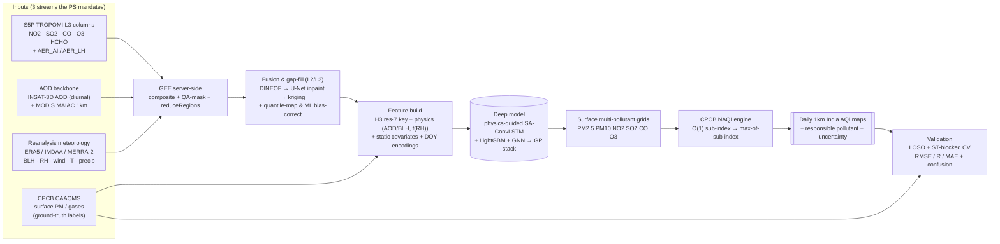

# Objective-1 Flow — Surface AQI Mapping over India

> **PS-required "image representing the problem statement" (Objective-1):**
> *A flow diagram showing columnar satellite data, CPCB surface data, and
> meteorological data fed into a CNN-LSTM deep-learning model to produce spatial
> maps of surface AQI.*

This page is the focused, single-screen version of that diagram with a written
walkthrough. The deep architecture behind every box is documented in
[`ARCHITECTURE.md`](ARCHITECTURE.md).

---

## Flow diagram

---

## Walkthrough

The pipeline ingests the three input streams the problem statement names —
**columnar satellite data**, **meteorological reanalysis**, and **CPCB ground
data** — and turns them into validated daily surface-AQI maps.

1. **Inputs.** Sentinel-5P TROPOMI L3 supplies the trace-gas columns
   (NO2, SO2, CO, O3, HCHO) plus the absorbing-aerosol index. The AOD backbone is
   MODIS MAIAC 1km (the quantitative anchor) gap-filled diurnally by the
   PS-mandated INSAT-3D AOD. Meteorology (boundary-layer height, RH, wind,
   temperature, precipitation, solar radiation) comes from ERA5 / IMDAA / MERRA-2.
   CPCB CAAQMS hourly observations are the supervised labels.

2. **GEE server-side reduction.** Google Earth Engine composites the imagery,
   applies per-product `qa_value` masks (NO2 ≥ 0.75; HCHO/SO2/CO ≥ 0.5), and uses
   `reduceRegions` to co-locate every column and met field onto CPCB station
   points in a single lazy pass — no bulk download (O(1) analyst effort). Only
   compact COG and GeoParquet artifacts leave the cloud.

3. **Fusion & gap-fill.** Clouds are the dominant obstacle (MAIAC daily India
   coverage is often <50%). A per-species cascade — DINEOF → U-Net
   partial-convolution inpainting → kriging fallback — plus gap-free
   MERRA-2 / CAMS / GEOS-CF priors yields a seamless daily cube. The cube is then
   bias-corrected to CPCB by regionalized quantile mapping followed by a LightGBM
   residual correction.

4. **Feature build.** Every pixel and station is tagged with its H3 res-7 integer
   cell — the universal join key that turns geometric joins into hash group-bys.
   Physics-guided channels (AOD/BLH PBL normalization, AOD·f(RH)⁻¹ hygroscopic
   growth, AER_AI aerosol type, the FNR = HCHO/NO2 regime flag) are the single
   largest pre-model accuracy lift. Static covariates (DEM, WorldCover, NDVI,
   nightlights, population, road density) and temporal encodings complete the
   `[B, T, C, H, W]` tensor.

5. **Model.** The PS-named **CNN-LSTM** family is realized as a physics-guided
   **SA-ConvLSTM** (ConvLSTM keeps the hidden state a 2-D map for spatially
   coherent full-grid output; temporal self-attention + channel attention fix
   long-range memory), pretrained on MERRA-2 / GEOS-CF then fine-tuned on CPCB.
   LightGBM and a wind-adjacency GNN are ensemble members; a Gaussian-Process
   stacker blends them (target daily R² ≈ 0.86).

6. **AQI engine.** Predicted per-pollutant concentrations feed the vectorized
   CPCB NAQI engine: `searchsorted` segment lookup → piecewise-linear sub-index →
   `nanmax` across pollutants under the ≥3-pollutant-and-PM validity mask. CO is
   carried in mg/m³; O3/CO use max(8h, 1h). The argmax names the responsible
   pollutant.

7. **Maps & validation.** Output is a daily 1km AQI COG plus responsible-pollutant
   and uncertainty layers. Accuracy is reported with the full **CV ladder**
   (random → temporal → spatial-block-with-buffer → spatiotemporal-blocked) led by
   leave-station-out numbers and a locked stratified hold-out, scored RMSE / R /
   R² / MAE with an AQI-category confusion matrix emphasizing Poor/Severe recall.
