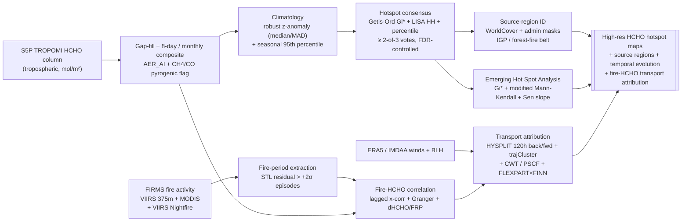

# Objective-2 Flow — HCHO Hotspots & Fire-Transport over India

> **PS-required "image representing the problem statement" (Objective-2):**
> *A flow diagram showing remote-sensing data, fire data, and reanalysis
> meteorological data processed to produce high-resolution HCHO hotspot maps,
> source-region identification, temporal evolution, and fire-HCHO correlation
> over India.*

This page is the focused, single-screen version of that diagram with a written
walkthrough. The deep architecture behind every box is documented in
[`ARCHITECTURE.md`](ARCHITECTURE.md).

---

## Flow diagram

---

## Walkthrough

The pipeline takes the three input streams the problem statement names —
**remote-sensing HCHO**, **fire data**, and **reanalysis meteorology** — and
produces hotspot maps, named source regions, a temporal-evolution deliverable,
and a fire-HCHO transport attribution.

1. **HCHO acquire + gap-fill.** TROPOMI HCHO is the noisiest key product
   (single-pixel error 30–100%). It is filtered to `qa_value ≥ 0.5` and
   aggregated to 0.05–0.1° and 8-day/monthly composites **before** any detection,
   then gap-filled with the same DINEOF → U-Net cascade as Objective-1. AER_AI
   smoke flags plus S5P CH4/CO (and optional OCO-2/3 SIF) separate pyrogenic
   (HCHO+CH4+CO) from biogenic (HCHO + high SIF, low CH4) enhancements.

2. **Fire-period extraction.** Daily fire-count / FRP series over Punjab+Haryana
   and the forest belts are built from FIRMS — VIIRS 375m as the primary source
   (3–5× more small stubble fires than MODIS), MODIS for the 2000+ climatology,
   and **VIIRS Nightfire** to recover evening burning that has shifted past the
   ~13:30 LT overpass. An episode is an STL residual > +2σ sustained ≥ 2 days,
   weighted by FRP not counts.

3. **Climatology & standardization.** A per-season robust z-anomaly (median/MAD)
   removes India's strong spatial gradient and seasonal cycle so that **one**
   threshold is comparable nationwide — the essential input to the consensus vote.

4. **Hotspot consensus (≥ 2-of-3).** A cell is a **confirmed** hotspot only if it
   passes at least two of: (a) Getis-Ord **Gi*** (star=True, 999 permutations,
   FDR p < 0.01 — the reviewer-trusted engine), (b) **LISA** HH cluster
   (HL flags fresh-fire point anomalies), (c) seasonal 95th-percentile / z > 2
   exceedance with contiguity support. This suppresses HCHO-noise striping that a
   single method produces.

5. **Emerging Hot Spot Analysis (headline temporal deliverable).** A space-time
   cube → Gi* per bin → modified (Hamed-Rao) Mann-Kendall + Sen's slope per cell
   labels each location New / Intensifying / Persistent / Diminishing, cleanly
   separating episodic biomass-burning hotspots from persistent IGP-industrial
   ones. Polygons come from HDBSCAN (haversine); multi-day plume episodes from
   ST-DBSCAN.

6. **Source-region identification.** Confirmed hotspots are overlaid on
   WorldCover (cropland = burning, built = traffic, forest = fire/biogenic) and
   admin masks to name the Indo-Gangetic Plain and forest-fire source zones, then
   ranked by WorldPop-weighted exposure.

7. **Fire-HCHO correlation.** Deseasonalized lagged cross-correlation (lags 0–7 d;
   expect a 0–2 d primary+secondary peak) and prewhitened Granger on stationary
   residuals, plus a background-subtracted dHCHO regressed on FRP (mol per MW)
   and an HCHO:NO2 (FNR) regime map. Cross-validated against FINNv2.5 daily
   (explicit speciated HCHO), bracketed by GFED for emission-factor uncertainty.

8. **Transport attribution.** ERA5-driven HYSPLIT 120 h back-trajectories at
   500 & 1000 m AGL from Delhi/Lucknow/Kanpur/Patna (and forward from fire
   clusters), trajCluster for the dominant NW Punjab/Haryana pathway, CWT
   (quantitative) + PSCF (probabilistic) source maps, openair polar plots for the
   wind-sector fingerprint, and optional FLEXPART × FINN for a quantitative
   "% of receptor HCHO from Punjab fires." **Convergence across the statistical,
   Lagrangian, and inventory lines is the credible result** — not any single
   method.
